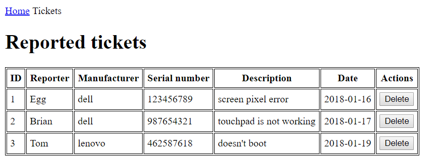

# License plates

## Highlights

- It has a simple frontend which can:

    - search full or *partial* license plate matches
    - it can filter to a sub category of plates (like police cars only)
    - it can start a new search by clicking on the make of the car

- The backend validates if the license plate is valid query

- You have to create two endpoints

## Database

Feel free to use the provided SQL file [for MySQL](assets/license-plates.sql).

## Frontend

### The form

- You should display a simple form to query a database, *don't waste time with
  design*

    - Create an input field in which the user can enter a license plate, like
      `HMZ-140`

    - Create a button with the text `Query database`

        - Clicking on the button should start an AJAX call to the backend
        - The frontend should display the results from the DB.

    - Add two radio boxes (*since it doesn't make sense to combine them*):

        - Police cars only. Filter for cars only starting with the `RB` prefix
        - Diplomats only. Filter for cars only staring with `DT` prefix

    - Each time you restart the search, the previous results (if any) should be
      cleared

### Search results

- Display the results from the backend in a HTML `<table>` the following format
  for the query `HMZ`

```text
| License plate | Brand   | Model | Color | Year |
| HMZ-140       | [Audi]  | A8    | red   | 2016 |
| HMZ-555       | [BMW]   | Z4    | pink  | 2011 |
```

- The app can display one or multiple rows of results since it should match
  partial queries as well

- Clicking on the `Brand` field should restart the search and display all cars
  with the same type

    - So clicking on "Audi" should restart the search and list all cars from the
      database regardless of the original query that resulted with this list

- If the user submits an invalid license plate, like `HMZ-@#5` then display an
  error message instead of the table

    - This happens when the response JSON from the server has the `result`
      property set to `error`

    - Display message: `Sorry, the submitted license plate is not valid`

## Backend

### Validation

You should validate all input submitted by the user!

- Only allow alphanumeric characters from the user: `[A-Z]`, `[0-9]` and the
  `-` dash symbol

For the license plate lookup only:

- Maximum length of the query is 7 characters

If the submitted data doesn't match any above criteria, respond with the
following JSON:

```json
{ "result": "error", "message": "invalid input" }
```

### Endpoints

#### GET `/search`

The license plate data and the limiting filter options should be passed via
query string.

Example query:

`http://localhost:8080/search?q=HMZ-140&police=1`

- use the `police` parameter to filter for police cars
- use the `diplomat` parameter to filter for diplomat cars

#### GET `/search/:brand`

This endpoint should return all the cars with the provided brand in query
parameter

Example query:

`http://localhost:8080/search/audi`

#### Responses

Both endpoint should return the same data structure:

```json
{
    "result": "ok",
    "data": [
        {
            "license": "HMZ-140",
            "brand": "Audi",
            "model": "A8",
            "year": 2016,
            "color": "red"
        },
        {
          "license": "HMZ-555",
          "brand": "BMZ",
          "model": "Z4",
          "year": 2011,
          "color": "pink"
        }
    ]
}
```

---

# Green Fox Notebook Error Reporter

Build a webapp that people can use to report technical issues.

## Highlights

- It has a frontend which can:

    - list all the tickets with details
    - save new error reports

### Frontend

The application consists of two screens.

#### Home (`index.html`)


It is built up from:

- a navigation bar, with a link to the tickets screen

- a heading with the title of the page

- a form to register a ticket

    - drop-down list with all the names from the database

        - the following names are already in the database: Egg, Tom, Mary, Brian, Daisy

    - input field to set the manufacturer

    - input field to set the serial number

    - textarea to set the description

    - a REPORT button which should start an AJAX call to the `/tickets` endpoint
      with the form data

#### Tickets (`tickets.html`)



It is built up from:

- a navigation bar, with a link to the home screen

- a heading with the title of the page

- a table to display all the tickets from the database

    - in the last column you should render a delete button which will remove the
      ticket permanently (also from the database)

### Backend

The backend should handle all the ticket related http requests and serve
the static content to the application.

#### Static content

All the static files should be served from a dedicated
folder (*e.g.: public, client, etc...*)

#### Endpoints

##### GET `/users`

This endpoint is used to list all the available users

Example query:

`GET http://localhost:8080/users`

- this should return a json with the users collected from the database

```json
{
    "users":
    [
        {
            "id" : 1,
            "name" : "Egg"
        },
        {
            "id" : 2,
            "name" : "Tom"
        },
        ...
    ]
}
```

##### GET `/tickets`

This endpoint should be responsible to list the tickets from the database.

- if there is no query parameter, the backend must send all the tickets

- if there is a manufacturer query parameter, the backend must filter only the
  tickets with the given manufacturer

- if there is a reporter query parameter, the backend must filter only the the
  tickets which are reported by the given user

Example query:

`GET http://localhost:8080/tickets?manufacturer=dell`

- this should return a json with every ticket where the manufacturer is "dell"

```json
{
    "tickets":
    [
        {
            "id" : 21,
            "reporter" : "Egg",
            "manufacturer" : "dell",
            "serial_number" : 123456789,
            "description" : "screen pixel error",
            "reported_at" : "2018-01-10T23:00:00.000Z"
        },
        {
            "id" : 27,
            "reporter" : "Brian",
            "manufacturer" : "dell",
            "serial_number" : 987654321,
            "description" : "touchpad is not working",
            "reported_at" : "2018-01-17T23:00:00.000Z"
        }
    ]
}
```

`GET http://localhost:8080/tickets?reporter=1`

- this should return a json with every ticket where the reporter's id is 1

`GET http://localhost:8080/tickets`

- this should return a json with all the tickets from the database

##### POST `/tickets`

This endpoint should:

- validate the sent data according to the following rules:

    - `reporter_id` is a number
    - `manufacturer` is specified
    - `serial_number` is specified
    - `description` is specified

- supplement the ticket with the current date

- save the ticket into database

- set the status code to 400 if the validation failed

- set the status code to 500 if any database error has occurred

Example query:

`POST http://localhost:8080/tickets`

This should be the request's body:

```json
{
    "reporter_id": 1,
    "manufacturer": "dell",
    "serial_number": 123481639,
    "description": "keyboard is not working"
}
```

- this should return a json with the newly created ticket

```json
{
    "id" : 22,
    "reporter": "Egg",
    "manufacturer": "dell",
    "serial_number": 123481639,
    "description": "keyboard is not working",
    "reported_at" : "2018-01-18T23:00:00.000Z"
}
```

##### DELETE `/tickets/:id`

It deletes the specified ticket if the request's header contains
the Authorization `HTTP header` with the value of `voala`. The endpoint should:

- validate the header

    - if authorization header is missing it should return an empty response
      with a 401 status code

- delete the ticket from the database

- return an empty response with a 204 status code

- return an empty response with a 500 status code if any error has occurred

Example query:

`DELETE http://localhost:8080/tickets/12`

- this should return an empty response, with a 204 status code
